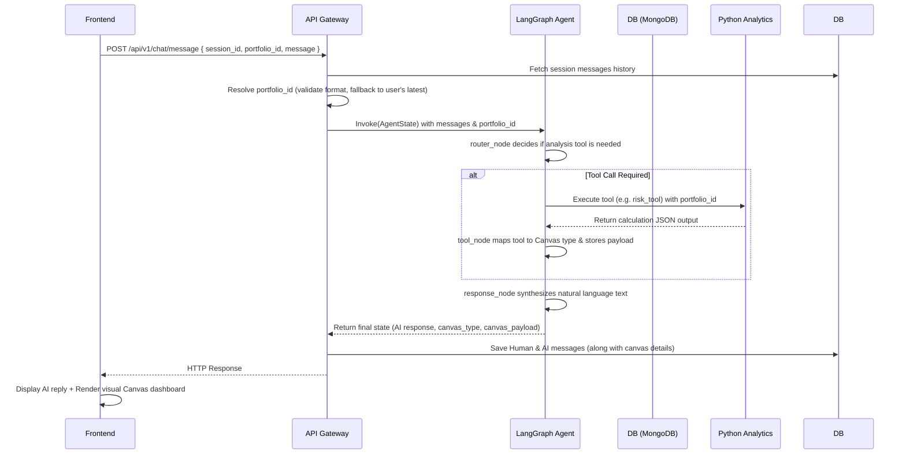

# AI Portfolio Analyzer

An intelligent, full-stack financial platform that combines conversational AI with deterministic quantitative portfolio analytics. Users can upload their investment portfolios, enrich them automatically with market data, and query insights conversationally. A dynamic canvas displays relevant metrics, charts, and simulated projections.

---

## 🚀 Getting Started

### 1. Backend Setup
1. Navigate to the `/backend` directory:
   ```bash
   cd backend
   ```
2. Activate your virtual environment and install dependencies:
   ```bash
   .\venv\Scripts\activate
   pip install -r requirements.txt
   ```
3. Set up your `.env` variables (e.g., `DATABASE_URL` for MongoDB, `OPENAI_API_KEY`, etc.).
4. Start the FastAPI development server:
   ```bash
   uvicorn app.main:app --reload
   ```

### 2. Frontend Setup
1. Navigate to the `/frontend` directory:
   ```bash
   cd frontend
   ```
2. Install the required Node packages:
   ```bash
   npm install
   ```
3. Launch the Next.js development server:
   ```bash
   npm run dev
   ```


---

## 🛠️ Feature Implementation Choices

### 1. Nifty 50 Benchmark Comparison (`^NSEI`)
* **What it does**: Compares your portfolio's performance directly against the **Nifty 50** stock market index.
* **How it works**:
  - **Smart Loading**: The backend downloads historical prices for the Nifty 50 index (`^NSEI`) on the fly. It is smart enough to skip fetching sector details or company profiles since Nifty 50 is a market index, not a company stock.
  - **Market Metrics**: It calculates **Beta** (how sensitive your portfolio is to market swings) and **Jensen's Alpha** (how much extra value your portfolio generated compared to the market index).
  - **Side-by-Side Visuals**: The UI displays a clean double-bar chart comparing your portfolio returns with Nifty 50 returns, alongside cards showing Alpha and Beta.

### 2. Multi-Session Conversation System
* **What it does**: Allows you to start, save, and switch between multiple chat sessions (similar to ChatGPT).
* **How it works**:
  - **Database Caching**: Every message, session title, and related chart state is saved in MongoDB.
  - **Sidebar Navigation**: You can click on past chats in the sidebar to load the conversation history and immediately restore the exact dashboard view that was active during that chat.
  - **URL Tracking**: The active session ID is kept in the browser URL (`?session_id=...`). If you refresh or share the link, the page loads that exact session.

### 3. Dynamic Canvas Dashboard Factory
* **What it does**: A dedicated visual workspace that automatically updates to show relevant charts based on your conversation.
* **How it works**:
  - When you ask a question (e.g., "Show me my stock correlation"), the AI replies in text and automatically swaps the canvas view to display the correct dashboard.
  - **Available Dashboards**:
    - `PerformanceDashboard`: Compares cumulative and annualized returns to Nifty 50.
    - `RiskDashboard`: Displays volatility, maximum historical drops, and daily Value at Risk (VaR).
    - `SectorExposureDashboard`: Displays bar charts showing how your investments are distributed across industries.
    - `CorrelationDashboard`: Shows a grid matrix showing how closely different holdings move in relation to each other.
    - `SimulationDashboard`: Shows projected risk/return forecasts if you change asset allocations.
    - `HistoricalDashboard`: Renders a timeline graph of historical stock close prices.
    - `FundamentalsDashboard`: Summarizes fundamental statistics like Price-to-Earnings (P/E) ratios.
    - `GeneralDashboard`: The starting page featuring quick prompt suggestion cards. Clicking any card autofills the prompt into your chat window.

### 4. Responsively Scrollable Tables
* **What it does**: Prevents wide tables in chat responses from stretching or breaking the layout.
* **How it works**:
  - If the AI generates a wide financial markdown table, the frontend wraps it in a horizontally scrollable container. This keeps the chat layout neat and readable on all screens.

---

## 🧠 Agent State & Portfolio State Management

### State Management Flow
The agent is orchestrated using **LangGraph** to process user messages, run analytics tools, and return natural language descriptions alongside canvas states.



### 1. Active Portfolio Identification & Fallbacks
Portfolio context is passed on every message request:
1. **Boundary Sanitization**: If the active portfolio ID passed by the client is invalid (e.g. `"None"`, `"null"`, `"undefined"`, or a non-24-character hexadecimal format), the backend sanitizes it to `None`.
2. **Database Verification**: The API validates that the requested portfolio ID exists in MongoDB.
3. **Implicit Fallback**: If no valid portfolio ID is specified, the backend automatically queries the database for the user's most recently uploaded portfolio and binds it to the conversational session.

### 2. Preserving Conversation History (Memory)
The LangGraph agent state is stateless across API invocations. To provide short-term memory:
* On every request, the backend retrieves all historical messages for the given `session_id` from the database.
* It maps database records into LangChain messages (`HumanMessage` and `AIMessage`) in chronological order.
* The conversation history list is fed into the `AgentState` as the primary message history before running the graph.

### 3. LangGraph Workflow Structure
* **`AgentState`**: A structured `TypedDict` holding:
  - `messages`: Annotated sequence of conversation history.
  - `portfolio_id`: The database ID of the active portfolio under analysis.
  - `canvas_type`: Identifies which dashboard UI component should load on the frontend.
  - `canvas_payload`: Holds the raw metrics and calculation results used by charts.
* **`router_node`**: Binds the active tools (`get_all_tools()`) to the OpenAI LLM. If the user query implies a financial analysis, the LLM requests a tool call (e.g., `performance_tool` or `correlation_tool`).
* **`tool_node`**: Automatically retrieves the `portfolio_id` from the state, calls the corresponding tool executor, captures the response, and translates the tool mapping into UI canvases (e.g. `correlation_tool` -> `CorrelationMatrix`).
* **`response_node`**: Formulates a clear conversational synthesis of the tool results. The LLM is restricted from performing math directly and must reference the values provided in the tool output.
