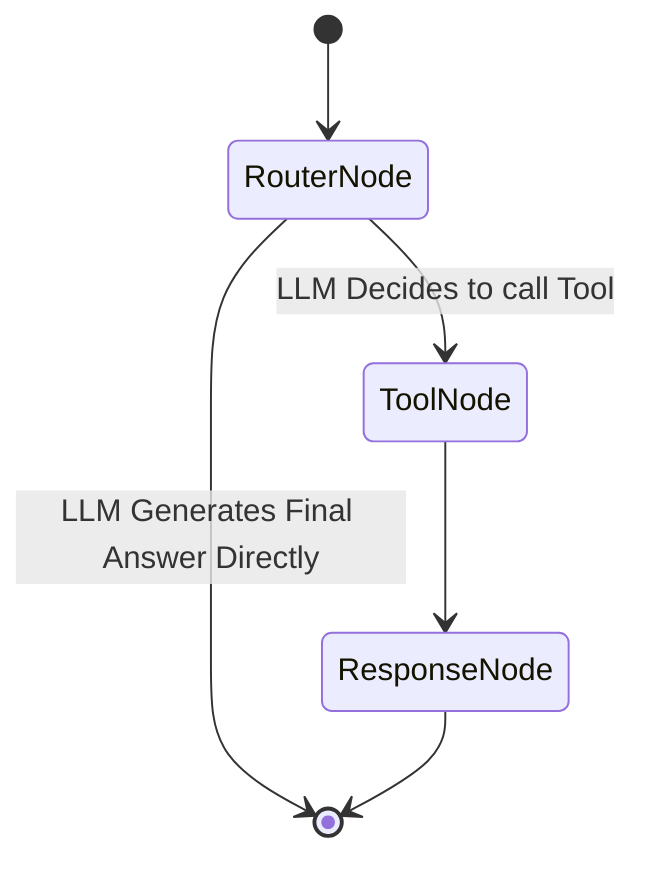

# Agent Architecture

The agent is implemented using LangGraph, providing a cyclic graph structure to route intents, select tools, and format responses.

## 1. State Definition
```python
from typing import TypedDict, Annotated, Sequence
import operator
from langchain_core.messages import BaseMessage

class AgentState(TypedDict):
    messages: Annotated[Sequence[BaseMessage], operator.add]
    portfolio_id: str
    canvas_type: str
    canvas_payload: dict
```

## 2. Graph Nodes

### **Node 1: Router Node (`router_node`)**
- **Purpose**: Analyze the user's message history to decide if a structured analytics tool call is required.
- **Implementation**: Binds tools to the OpenAI LLM (`llm.bind_tools(tools)`). If the LLM generates a tool call in its response, the workflow proceeds to execution.

### **Node 2: Tool Node (`tool_node`)**
- **Purpose**: Executes the chosen LangChain tool, automatically injecting the current `portfolio_id` if needed.
- **Canvas Mapping**: Evaluates the executed tool and maps it to the appropriate canvas dashboard (e.g. `correlation_tool` -> `CorrelationMatrix`, `historical_tool` -> `HistoricalDashboard`). It returns a `ToolMessage` with the calculation output and updates `canvas_type` and `canvas_payload`.

### **Node 3: Response Node (`response_node`)**
- **Purpose**: Takes the raw tool output from the database or services and uses the OpenAI LLM to synthesize a helpful, conversational, natural language explanation.
- **Constraint**: Must NOT perform mathematical calculations; it relies strictly on the structured tool outputs.

## 3. Workflow


## 4. Prompt Management
Prompts are not hardcoded. They are managed centrally via a `PromptManager` class, allowing easy iteration, A/B testing, and evaluation. 

## 5. Fallback Mechanisms
- If a tool fails to execute or external data is missing, the Tool Executor returns an error JSON.
- The Response Generator informs the user truthfully: "I am unable to calculate risk at the moment because pricing data for XYZ is unavailable." No hallucination is permitted.
