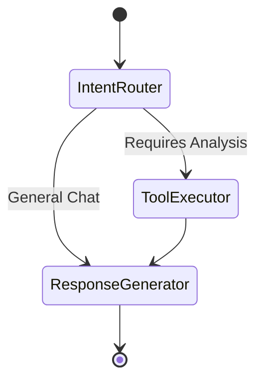

# Agent Architecture

The agent is implemented using LangGraph, providing a cyclic graph structure to route intents, select tools, and format responses.

## 1. State Definition
```python
from typing import TypedDict, List
from langchain_core.messages import BaseMessage

class AgentState(TypedDict):
    messages: List[BaseMessage]
    portfolio_id: str
    selected_tool: str | None
    tool_output: dict | None
    canvas_type: str | None
    canvas_payload: dict | None
```

## 2. Graph Nodes

### **Node 1: Intent Router**
- **Purpose**: Analyze the user's message and determine if a specific tool (Analytics) is needed or if it's a general question.
- **LLM Prompt**: "You are a routing agent. Given the query, output the tool name to use, or 'none' if no tool is required."

### **Node 2: Tool Executor**
- **Purpose**: Executes the corresponding LangChain Tool (which internally calls the deterministic Python Services).
- **Execution**: The tool returns a structured JSON object.
- **State Update**: Updates `tool_output` in the State.

### **Node 3: Response Generator**
- **Purpose**: Takes the `tool_output` and the original user query, and generates a conversational response.
- **Constraint**: Must NOT perform mathematical operations. Must rely entirely on `tool_output`.
- **Canvas Selection**: Based on the `tool_output` type, determines the appropriate `canvas_type` (e.g., `PerformanceDashboard`, `CorrelationMatrix`) and sets `canvas_payload`.

## 3. Workflow


## 4. Prompt Management
Prompts are not hardcoded. They are managed centrally via a `PromptManager` class, allowing easy iteration, A/B testing, and evaluation. 

## 5. Fallback Mechanisms
- If a tool fails to execute or external data is missing, the Tool Executor returns an error JSON.
- The Response Generator informs the user truthfully: "I am unable to calculate risk at the moment because pricing data for XYZ is unavailable." No hallucination is permitted.
