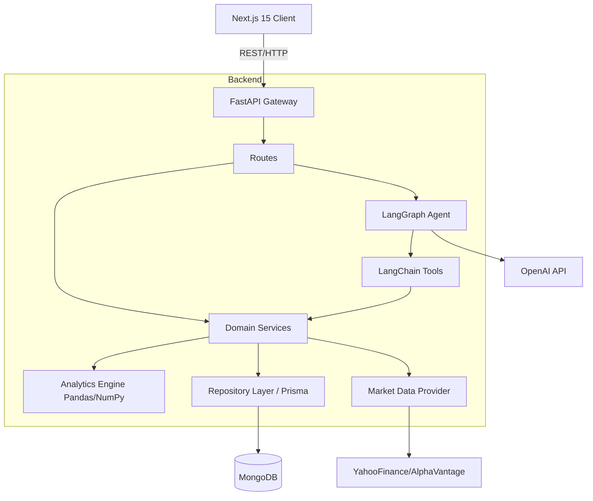
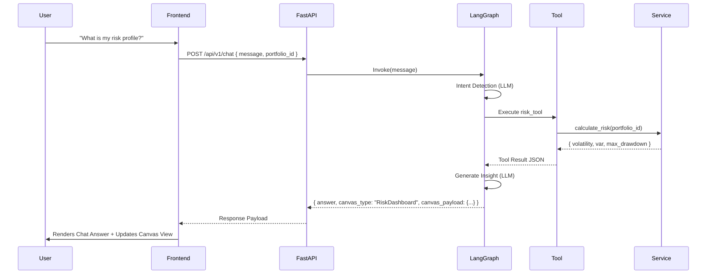

# System Architecture

## 1. High-Level Architecture
The system follows a classic decoupled client-server architecture with an intelligent agentic middle layer.

## 2. Frontend Architecture
- **Pages/Layouts**: Next.js App Router for high-level structure.
- **Canvas System**: A factory component (`DynamicCanvas`) that receives an `activeCanvas` type and `canvasPayload` from the backend, and dynamically mounts the corresponding visual dashboard:
  - **`PerformanceDashboard`**: Compares portfolio performance against the **Nifty 50** (`^NSEI`) benchmark index (returns, CAPM Beta, Jensen's Alpha).
  - **`RiskDashboard`**: Displays deterministic risk metrics (Annualized Volatility, Max Drawdown, 95% VaR, 95% CVaR).
  - **`SectorExposureDashboard`**: Highlights concentration analysis and sector distribution.
  - **`CorrelationDashboard`**: Shows a matrix heatmap of pairwise historical price correlations between holdings.
  - **`SimulationDashboard`**: Displays projected risk/return outcomes from what-if weight rebalancing scenarios.
  - **`HistoricalDashboard`**: Renders close price timelines for portfolio holdings.
  - **`FundamentalsDashboard`**: Lists stock names, sectors, market capitalizations, and trailing/forward PE ratios.
  - **`GeneralDashboard`**: Default onboarding view containing quick analysis cards with dynamic prompt autofill capability.
- **State**: Zustand for global UI state (current active canvas, portfolio identifier, and sidebar status), TanStack Query for server state (caching responses, polling for data enrichment status).

## 3. Backend Architecture
The backend is structured into distinct modules:
- `/api`: FastAPI routers, dependency injection, and Pydantic request/response models.
- `/services`: Business logic, portfolio management, upload orchestration.
- `/analytics`: Deterministic Python math modules (Risk, Performance, etc.).
- `/agent`: LangGraph state machine, nodes, and router logic.
- `/tools`: LangChain tool wrappers that interface strictly with `/services` and `/analytics`.
- `/data_providers`: Strategy pattern implementation for fetching external market data.
- `/db`: Prisma client and repository implementations.

## 4. Data Flow: Chat and Canvas

